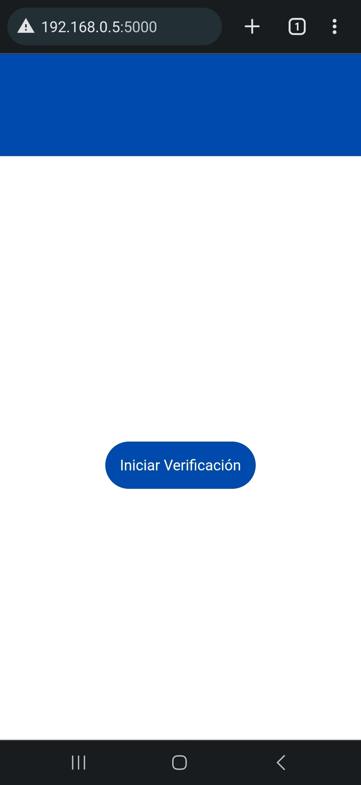
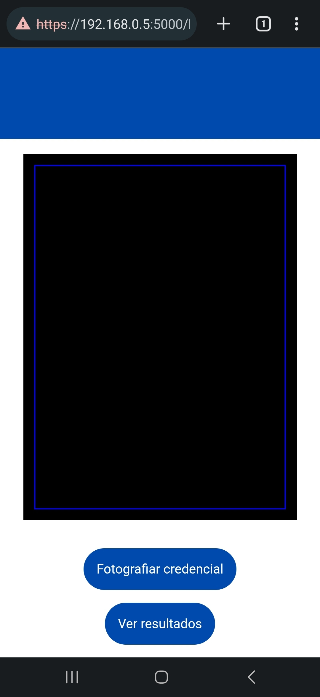
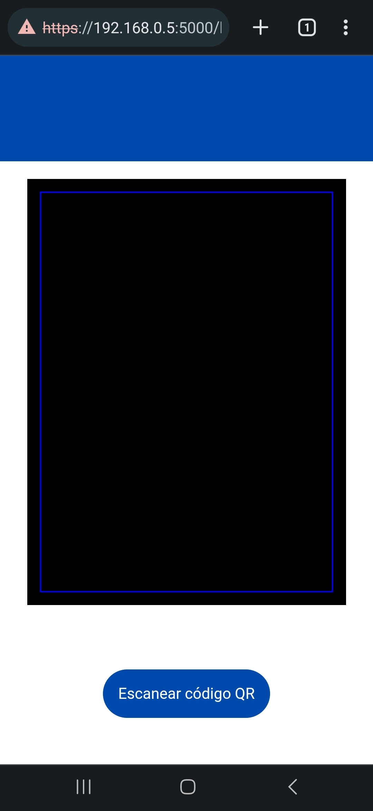
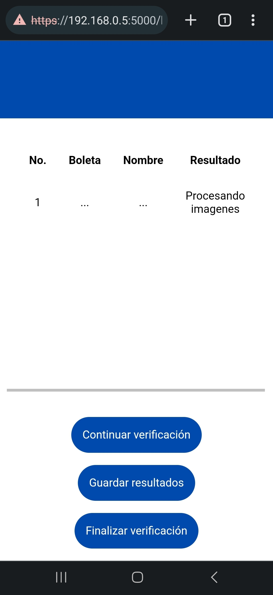

# Verificación de información en credenciales escolares mediante técnicas de visión artificial

## Autores
- Munguia Poblano Erwin
- Olarte Astudillo Rodrigo
- Ortiz Cruz Luis Gerardo  

## Resumen
Este trabajo terminal desarrolla y mide el rendimiento de una herramienta para la verificación de información en las credenciales estudiantiles de la Escuela Superior de Cómputo mediante técnicas de visión artificial. La herramienta verifica los datos de la credencial extrayéndolos mediante OCR y comparándolos con los datos registrados en la Dirección de Administración Escolar (DAE), accesibles a través del código QR de la credencial.

## Palabras clave
- Credencial escolar
- Inteligencia artificial
- Procesamiento de texto
- Visión artificial

## Introducción
Este proyecto aborda el problema de verificación de información en credenciales escolares no inteligentes, que actualmente dependen de procesos manuales. La herramienta propuesta automatiza esta verificación mediante visión artificial, sin requerir dispositivos externos como los utilizados en tarjetas inteligentes.

El desarrollo incluye:
- **Extracción de texto**: Utilizando OCR para obtener información visible en la credencial.
- **Raspado web**: Para extraer datos oficiales de la DAE.
- **Comparación**: Análisis de similitud entre los datos extraídos de la credencial y los oficiales.

### Objetivos
1. Obtener los caracteres presentes en la credencial escolar mediante visión artificial.
2. Consultar y extraer información oficial de la credencial a través de raspado web.
3. Comprobar la coincidencia entre la información adquirida y la oficial.
4. Presentar los resultados de la verificación.

### Hipótesis
- Los algoritmos de OCR logran una exactitud a nivel de letras superior al 70%.
- La herramienta verifica información en menos de 30 segundos en promedio.
- La exactitud es similar en credenciales con distintos formatos de diseño (vertical/horizontal).

## Tecnologías Utilizadas
- **OCR**: EasyOCR, Pytesseract, implementación propia.
- **Librerías Python**: OpenCV, QReader, Requests, Beautiful Soup.
- **Modelos de clasificación**: Redes neuronales convolucionales y recurrentes.
- **Comparación de cadenas**: Distancia de Levenshtein modificada.

## Metodología
1. **Extracción de texto**: Procesos de OCR utilizando diferentes implementaciones (EasyOCR, Pytesseract y un modelo propio).
2. **Extracción de datos oficiales**: Uso de raspado web para obtener información de la DAE.
3. **Comparación de información**: Cálculo de similitud entre cadenas para determinar coincidencias.

### Detalles Técnicos
#### EasyOCR
- Red neuronal convolucional CRAFT para detección de texto.
- Redes recurrentes LSTM para predicción de caracteres.

#### Pytesseract
- Análisis de disposición del texto y decodificación usando clasificadores de patrones.

#### Implementación Propia
- Segmentación por color y procesamiento mediante la red EAST.
- Clasificador con arquitectura CNN para reconocimiento de caracteres.

## Resultados Esperados
- Una herramienta funcional capaz de extraer y verificar información de credenciales escolares.
- Reducción del tiempo necesario para la verificación manual.
- Alta exactitud y consistencia en diferentes formatos de credenciales.

## **Instalación**
1. Clona este repositorio:
   ```bash
   git clone https://github.com/MunIori/Trabajo-Terminal.git
2. Navega al directorio del proyecto
3. Instala las dependencias necesarias mediante pip o un entorno:
   ```bash
   pip install -r requirements.txt
   conda env create -f environment.yml
4. Inicia la herramienta:
   ```bash
   python servidor.py

## Uso
1. Carga una imagen de la credencial estudiantil en el formulario de la página.
2. La herramienta extraerá el texto de la imagen utilizando OCR.
3. El sistema consultará la base de datos de la Dirección de Administración Escolar para obtener la información oficial.
4. Se mostrará una comparación de la información extraída con la información oficial, indicando si los datos coinciden.

## Hipotésis Evaluadas
- H_0: "Media de exactitud a nivel de letras" = 0.7
- H_a: "Media de exactitud a nivel de letras" > 0.7
- H_0: "Media de tiempo de la herramienta" = 30 segundos
- H_a: "Media de tiempo de la herramienta" < 30 segundos
- H_0: "Media de exactitud a nivel de letras" de credenciales horizontales = "Media de exactitud a nivel de letras" de credenciales verticales
- H_a: "Media de exactitud a nivel de letras" de credenciales horizontales ≠ "Media de exactitud a nivel de letras" de credenciales verticales

## Capturas de Pantalla




